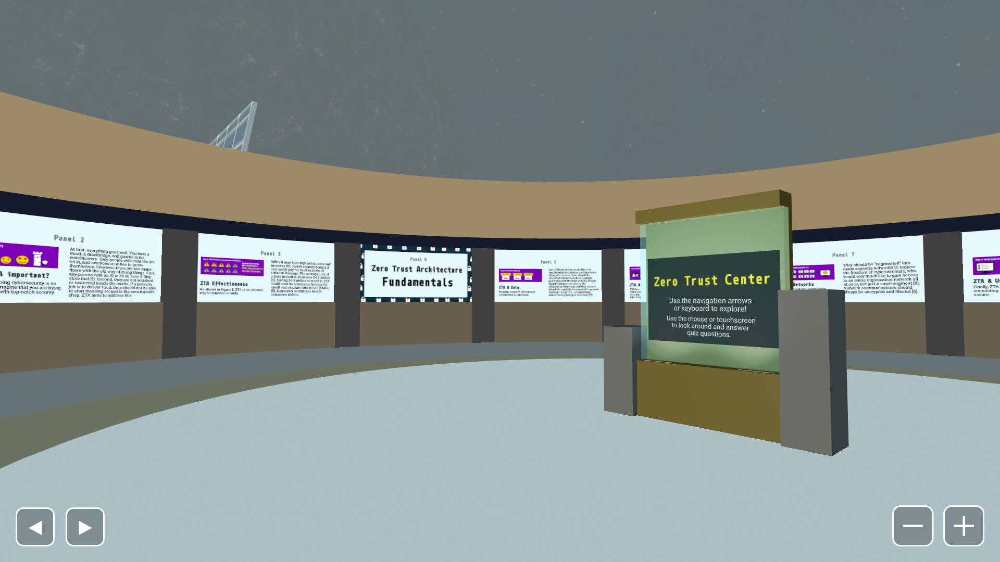

# Zero Trust Center

## Overview
This project is the culmination of a quarter's worth of work for a technical writing class. It is 3D web experience meant to make the complicated subject of zero trust architecture engaging and understandable for a non-technical audience. This project was a learning experience and still has some flaws, but please enjoy!

Try it at https://ford-desk.github.io/ztcenter/ztCenter.html

## License
This program relies on a framework for building browser based 3D, AR and VR experiences developed by A-Frame authors. Their framework is under an [MIT License](LICENSE-MIT).
To use and cite information and media content, please see the references information panel. The citations for the spheremap and solar panel images are included as [13] and [14].
The rest of the work is licensed under [Creative Commons Zero v1.0 Universal](LICENSE-CC0).
